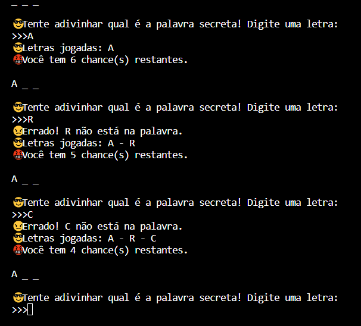

# JOGO DA FORCA - VOLUME 1
👨‍💻ESSE É PEQUENO JOGO QUE RODA NO CONSOLE DA IDE.

 <br>

## DESCRIÇÃO:
Este programa implementa um jogo simples de forca em Python. Ele seleciona aleatoriamente uma palavra de um arquivo chamado "WORD.txt" localizado no mesmo diretório do script, oculta a palavra, e permite que o usuário adivinhe as letras. O jogo fornece feedback sobre as letras corretas e incorretas, exibe o progresso da palavra oculta e termina quando o jogador adivinha corretamente a palavra ou excede o número máximo de tentativas (6 chances). O programa inclui também uma opção de "hack" que revela a palavra secreta, útil para depuração.

## EXECUTANDO O JOGO:
1. No arquivo `WORD.txt`, insira uma palavra em cada linha. Essas palavras serão escolhidas aleatoriamente para o jogo.
2. Navegue até o diretório `./CODIGO`, e execute o arquivo Python com o comando:
```bash
python CODIGO.py
```
3. O jogo começará, exibindo uma série de traços representando as letras da palavra secreta.
4. Você tem 6 chances para adivinhar a palavra secreta, digitando uma letra de cada vez.
5. Se você adivinhar corretamente todas as letras da palavra, você vence. Se não, o jogo termina e revela a palavra secreta.

## SOBRE O EXECUTAVEL:
### 1. EXECUTANDO:
   * O executável gerado está disponível apenas para sistemas **Windows x64** e pode ser encontrado no diretório:
   ```
   ./APP
   ```

   * Para executá-lo, basta dar dois cliques. Ele é especialmente útil em máquinas onde o **Python não está instalado**.
   * Trata-se da **mesma aplicação contida no arquivo `./CODIGO/CODIGO.py`**, porém empacotada de forma independente.
   * Se necessário, você pode recompilar o executável a qualquer momento.

### 2. GERANDO:
   **1. Instalação do [PyInstaller:](https://pyinstaller.org/en/stable/)**
   - Certifique-se de ter o PyInstaller instalado. Se não tiver, instale usando o comando abaixo:
   ```bash
   pip install pyinstaller
   ```

   **2. Gerando o Executável**
   - No diretório `./CODIGO`, execute o comando abaixo para gerar o executável a partir do arquivo `.spec`:

   ```bash
   pyinstaller EXECUTAVEL.spec
   ```

   - O arquivo `JOGO DA FORCA 1.exe` será criado dentro da pasta `./CODIGO/dist`.

   - Após a geração, você pode mover o executável para `./APP` e remover as pastas temporárias `./CODIGO/build` e `./CODIGO/dist`.

   - Para executar o aplicativo, basta dar dois cliques no arquivo `.exe`.

## NÃO SABE?
- Entendemos que para manipular arquivos em muitas linguagens e tecnologias, é necessário possuir conhecimento nessas áreas. Para auxiliar nesse aprendizado, oferecemos cursos gratuitos disponíveis:
* [CURSO DE PYTHON](https://github.com/VILHALVA/CURSO-DE-PYTHON)
* [CONFIRA MAIS CURSOS](https://github.com/VILHALVA?tab=repositories&q=+topic:CURSO)

## CREDITOS:
- [PROJETO CRIADO PELO VILHALVA](https://github.com/VILHALVA)
